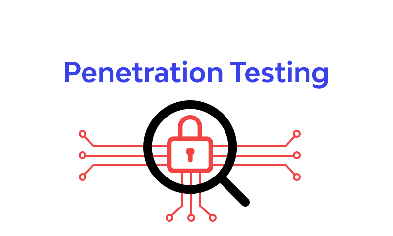
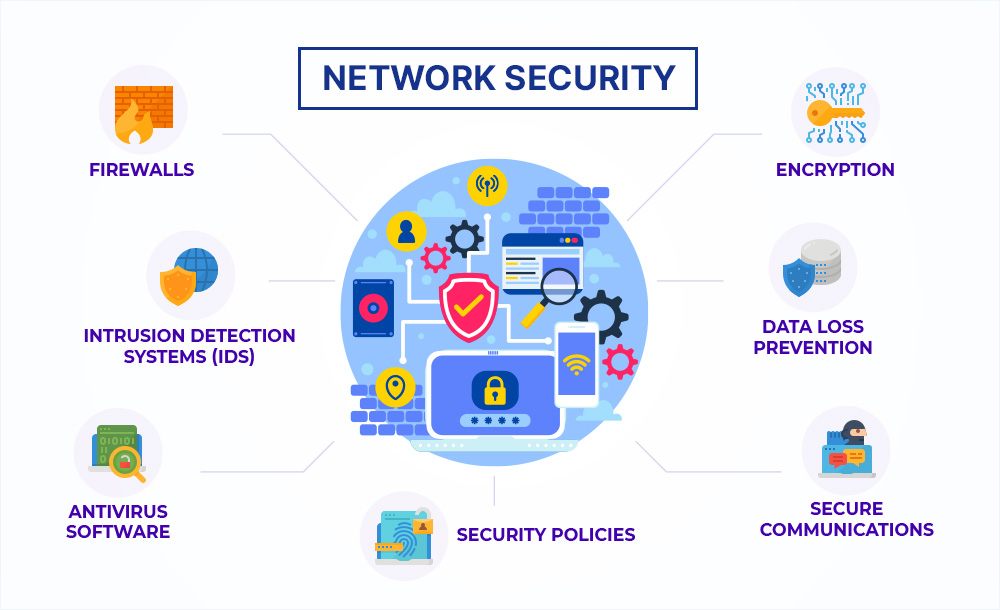

# CAT_Reloaded-Cyber_Security-Road_Map

## **About Cyber Security**
### What is Cyber Security? 
Cyber Security is the practice of protecting computer systems, networks, programs, and data from digital attacks, unauthorized access, damage, or theft.
### Why Cyber Security  
+ According to the IBM Cost of a Data Breach Report, the global average cost of a data breach surged to USD 4.45 million in 2023, marking a 15% increase in three years. 
	Consequently, 51% of organizations plan to boost security investments, focusing on incident response planning, employee training, and advanced threat detection tools. This underscores the escalating financial impact of breaches, prompting a strategic shift towards fortified cybersecurity measures to mitigate risks and preserve organizational resilience.
+ The fact that the Middle East ranks second in data breach costs by region, averaging USD 8.07 million after the United States, signals a growing necessity for individuals aspiring to learn cybersecurity. This trend underscores the increasing demand for cybersecurity professionals in the region's future landscape. 

	[IBM Report](https://www.ibm.com/downloads/cas/E3G5JMBP)
## Before starting you should know:

<aside>
📌 Cybersecurity has an extensive number of fields , so you should state your position in it.  
</aside>  

 
 

**The next few videos will help you to choose your field, know about them and follow you passion** *Don't neglect this phase as all the results in the future depend on your decision about which is more suitable for you.*

1. **Source 1 : [So you wanna do security?](https://youtu.be/i8rizLc4hc0) (Muhammad Gamal’s Video)**
2. **Source 2 : Nakerah Network [Playlist](https://youtube.com/playlist?list=PL_yseowcuqYI9cE8Qonbr0SGN1XQFEEPg)**
3. **Source 3 : [يوم في حياة X](https://www.youtube.com/watch?v=ompZWkWsn9A&list=PLv7cogHXoVhXIg4R6-eyws4isM2-sh2St) (Ebrahim Hegazy)** *to know more about each track life cycle*
4. **Source 4 : If you have decided that the offensive side is more appealing to you than the defensive, you should watch this [video](https://youtu.be/f3hP49LGoik?si=tNaDX4bRuF5M1EMS) (Ebrahim Hegazy)** *to learn more about penetration testing, red teaming, bug hunting, and what to study for each.*

<aside>
📌 Once you have knowledge about the various tracks within cyber security, you can delve deeper into the suitable one to gain a more comprehensive understanding and determine if it aligns with your passion or not.
</aside>

---

**▶ What are our Sub-Circles in CAT Reloaded?**

1. **Penetration testing**
    - **Web Pentesting** ( Level 1 )
    - **Network Pentesting** ( Level 2 )
    - **Mobile Pentesting** ( Level 3 )
    - **Telecom Pentesting** ( New circle Domain )
1. **Reverse Engineering & Malware Analysis**
2. **Network Security**
3. **SOC analyst & DFIR**

---

<aside>
📌 Take your time while deciding which field to study While doing That we will get into The ENTRY Level so we don't waste time

</aside>

---

## Essential skills Before Cyber Security 

Before delving into Cyber Security, it is essential to acquire foundational skills. These skills serve as a strong base, allowing for a comprehensive understanding and proficiency in the field.

1. **An awareness of computer science and programming concepts is essential.**
2. security essential skills 
	- Network basics
	- Linux OS awareness 
	- Cryptography fundamentals
	- Bash scripting

	[Here is the content to study through this phase](https://zyadelsayed.notion.site/Entry-level-d1da5cd08ccc457db6fa653605b31e8b?pvs=4)
## Cyber Security Paths Roadmaps 

---
Always remember that: There is no BEST WAY but always there is a SUITABLE WAY

### **1️⃣ Penetration Testing Path**

---
#### 1. **Web App Penetration testing Path (WAPTR)**

**📌 1. Here’s The [new Roadmap](https://zyadelsayed.notion.site/WEB-Penetration-testing-6ae02070f55646358202dc28d0d565ff?pvs=4) based on the Main roadmap but more simplified, updated, divided into sections and has study time line beside resources ( We will make sure to keep it updated )**

**Our Main Roadmap [HERE](https://drive.google.com/file/d/1YlYBgkith2ycK8aqP2bv_a-S9YD6LANi/view?usp=sharing) By Muhammad Gamal**

📌 2. To Practice:
- Create an account on [hackerone](https://www.hackerone.com/) , [bugcrowd](https://www.bugcrowd.com/), [intigriti](https://www.intigriti.com/programs)
- You should practice very well so you can solve [portswigger labs](https://portswigger.net/web-security)
- Other resources for simple practice:
There is no BEST WAY but always there is a SUITABLE WAY

|**1️⃣ [bwapp](http://www.itsecgames.com/)** | **4️⃣ [Hack The Box](https://referral.hackthebox.com/mzxDovt)** | 
| --- |  --- |
| **2️⃣ [Dvwa](https://tryhackme.com/room/dvwa)** | **5️⃣ [OWASP Juice](https://tryhackme.com/room/owaspjuiceshop)** |
|**3️⃣  [OWASP Broken WAP](https://sourceforge.net/projects/owaspbwa/)   &emsp;&ensp;&ensp;[Installation](https://www.youtube.com/watch?v=p7uqu4o3RhY&t=507s)**|**6️⃣ [TryHackMe](https://tryhackme.com/signup?referrer=652bf42512e834834064b3c8)**| 

- **If you are stuck in a lab solution, try searching on [Google](http://google.com/)**
---
#### 2. **API Penetration testing**

**📌 1. Here’s The [Roadmap](https://cyber-samurai.notion.site/API-Hacking-RoadMap-0817ef70509649dfaec2891ffba1f7db)**

📌 2. To Practice:
- [OWASP crAPI](https://github.com/OWASP/crAPI)
- [roottusk/vapi](https://github.com/roottusk/vapi)
- [KONTRA's OWASP Top 10 for API](https://application.security/free/owasp-top-10-API)
- [InsiderPhD/Generic-University](https://github.com/InsiderPhD/Generic-University)
- [snoopysecurity/dvws-node](https://github.com/snoopysecurity/dvws-node)
- [DevSlop/Pixi](https://github.com/DevSlop/Pixi)
- [optiv/rest-api-goat](https://github.com/optiv/rest-api-goat)
- [marmicode/websheep](https://github.com/marmicode/websheep)
  

---
#### **3. Network Penetration testing Path (NPTR)**

**📌 1. For our Study [Time-line](https://ahmedwaly.notion.site/Network-Timeline-d12dcffe237049b391ccbd7db8743f29)**

Our Main Roadmap [HERE](https://drive.google.com/file/d/1OGCm2PHs0qX1NqmkeZFv9q-lo10fPbht/view?usp=sharing) includes many steps from Zero to Hero BTW you will need to practice more.

**📌 2. You can Practice on Machines [HTB](https://www.hackthebox.eu/) , [tryHackMe](https://tryhackme.com/) , [Vulnhub Walkthrough](https://github.com/Ignitetechnologies/Vulnhub-CTF-Writeups)**

---
### **2️⃣ Reverse Engineering & Malware Analysis Path**

 
 

- **Here's our New [Roadmap](https://drive.google.com/file/d/1KIbYmByu0Cy35BWRzSMphzRtWGKfALFU/view?usp=sharing), We will make sure to keep it updated.**
- **Here’s our Main [Roadmap](https://drive.google.com/file/d/13nDt8I-LoUq350HgeVq0UVhoF9qyhQVh/view?usp=sharing)**

---

### **3️⃣ Network Security Path (defensive)**

 
 

**📌 Here is our [Network Security Roadmap](https://tan-ravioli-dbf.notion.site/Network-Security-df42ce9c0795434fb295fd5f1a0a0b60?pvs=4)**

---

### **4️⃣ SOC Analyst & DFIR PATH**

 
 

**📌Here is our SOC & DFIR [Roadmap](https://drive.google.com/file/d/14kQBiI_U17_rzwXpJpSEYnWtblfVYwn1/view?usp=sharing)**

---
## Circle leaders

| Leader | Period |
| --- |--- |
| [Nidal Fikri](https://www.linkedin.com/in/nidal-fikri-kamil/)| 2018-2019 |
| [Yasser Elsenbary](https://www.linkedin.com/in/yasserelsnbary/)|2019-2020, 2020-2021 |
| [Khalid Emad](https://www.linkedin.com/in/khalid-emad/) | 2021-2022 |
| [Ibrahim Radi](https://www.linkedin.com/in/ibraradi9)| 2022-2023|
|[Zyad Elsayed](https://www.linkedin.com/in/zyad-abdelbary/)|2023-2024|

