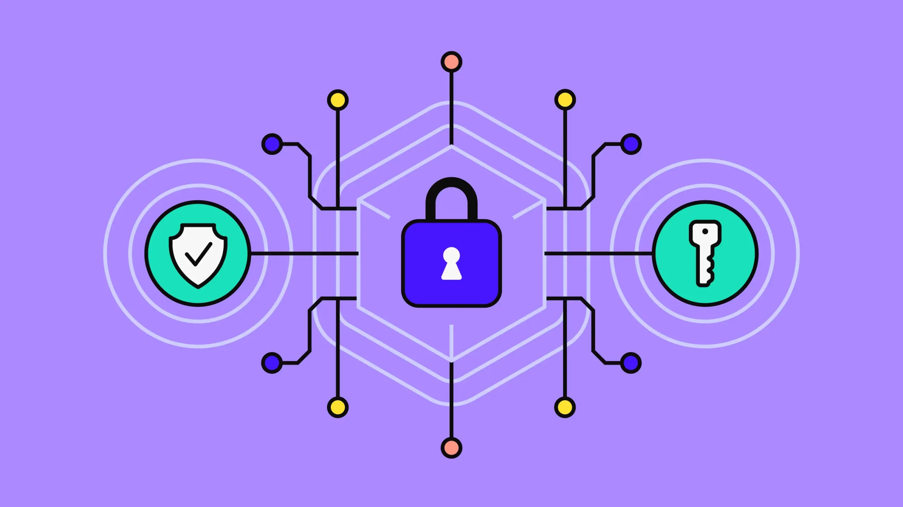

# CAT Reloaded Cyber_Security Road Map

<blockquote>
  <h3 align="center"><em>So, you choose the hard way :)</em></h3>
</blockquote>

## Before we start, let's answer a few FAQs:

### 1. What is cyber security?

Think of cyber security as the digital version of having a really good lock on your front door, plus a guard dog, a security camera, and maybe a moat with alligators—just to be safe. It's all about keeping the bad guys (a.k.a. hackers) from sneaking into your online world to mess with your stuff, steal your secrets, or just cause chaos. These sneaky attacks can aim to swipe your sensitive info, blackmail you, or bring your systems to a grinding halt. So, cyber security is basically your all-in-one toolkit to keep the digital boogeymen out and your data safe and sound.

### 2. Why do I learn cybersecurity?

So, why should you dive into cybersecurity? Well, in today’s world, everything's going digital—your shopping, your banking, even your grandma's cat videos. But with great ~~connectivity~~ comes great responsibility... and a bunch of cyber threats. Here’s why getting into cybersecurity is a smart move:

- **Protect your stuff**: Keep your personal info and company data safe from those pesky cyber thieves who want to steal your secrets.
- **Be a digital hero**: Help protect the online world and make it safer for everyone—think of it as your superhero origin story.
- **Score some sweet career points**: Cybersecurity pros are in high demand, so you'll be entering a field with tons of job opportunities and room to grow.
- **You can also be the "good hacker"**: Cybersecurity isn't just about defending—you can go on the offensive too, if that's your thing.

And, let’s be real—cybersecurity pays well too. So, not only do you get to be the digital defender, but you also get to bring home some serious cash. XD

**Jokes aside:**

افتكر دايما وانت بتتعلم علم زي ده انك بتتعلمه عشان تنفع الامة والمسلمين  وان دورك لا يقل اهمية عن دور اي شغلانة هدفها حماية المسلم واملاكه, وان انت بتعمل العمل ده لوجه خالص لله بهدف تعزيز قوتها كأمة ف العالم الحديث

### 3. What will I be able to do and what's not?

- Sniff out and smack down common cyber threats like a pro.
- Set up digital fortresses to protect systems and data from the bad guys.
- Play detective by finding and fixing vulnerabilities before hackers do.
- Build and keep an eye on secure networks, making sure everything runs smoothly.
- Create kick-ass plans for what to do when (not if) something goes wrong.

But let’s clear up a few things—cybersecurity isn’t about:
- Magically making everything 100% secure, because, **spoiler alert**, new threats are always popping up.
- Turning into a hacker to break into your crash's Facebook account or steal your neighbor's Wi-Fi password (seriously, that's illegal).
- Becoming an all-knowing cybersecurity guru overnight—this stuff takes time, practice, and constant learning to master.

So, while you’ll be pretty awesome at protecting the digital world, you’re not going to turn into a super-hacker vigilante. Sorry, no _**Matrix**_ moments here :(

### 4. What are the most famous fields of cybersecurity?

- Network Security
- Penetration Testing
- Digital Forensics
- Incident Response
- Malware Analysis
- and much more, when you can learn about all of them from these amazing videos ->  [So you wanna do security?](https://youtu.be/i8rizLc4hc0) | [يوم في حياة X](https://www.youtube.com/watch?v=ompZWkWsn9A&list=PLv7cogHXoVhXIg4R6-eyws4isM2-sh2St) | 

<aside>
📌 Once you have knowledge about the various tracks within cyber security, you can delve deeper into the suitable one to gain a more comprehensive understanding and determine if it aligns with your passion or not.
</aside>
 

ok, enough talking and let's start the real show.

---

**▶ What are our Sub-Circles in CAT Reloaded?**

1. **Penetration testing**
    - **Web Pentesting** ( Level 1 )
    - **Network Pentesting** ( Level 2 )
    - **Mobile Pentesting** ( Level 3 soon )
2. **Reverse Engineering & Malware Analysis** ( Level 1 & 2 )
3. **Network Security**
4. **SOC analyst & DFIR**
5. **Cryptography** ( New 🌟)

---

<aside>
📌 Take your time while deciding which field to study While doing That we will get into The ENTRY Level so we don't waste time

</aside>

---

## Essential skills Before Cyber Security 

Before delving into Cyber Security, it is essential to acquire foundational skills. These skills serve as a strong base, allowing for a comprehensive understanding and proficiency in the field.

1. **An awareness of computer science and programming concepts is essential.**
2. security essential skills 
	- Network basics
	- Linux OS awareness 
	- Programming
	- Cryptography fundamentals
	
	[Here is the content to study through this phase](https://www.notion.so/eljooker/Entry-Level-Roadmap-12f3f791038f807b9b84cf7d875a6e5d)
## Cyber Security Paths Roadmaps 

---
Always remember that: There is no BEST WAY but always there is a SUITABLE WAY

### 1️⃣ **Penetration Testing Path**

---

#### 1.  **Web App Penetration Testing Path (WAPTR)**

**📜 Resources:**  
- **[New Roadmap](https://third-open-099.notion.site/Penetration-testing-13bb1f518de7804f9220c035f65bdb87?pvs=4)** - Simplified, updated roadmap with study timeline.  
- **[Main Roadmap by Muhammad Gamal](https://drive.google.com/file/d/1YlYBgkith2ycK8aqP2bv_a-S9YD6LANi/view?usp=sharing)** - Comprehensive web application security guide.

---

#### 2.  **Network Penetration Testing Path (NPTR)**

**📜 Resources:**  
- **[Network Penetration New Roadmap](https://third-open-099.notion.site/Roadmap-for-Network-Pentest-Level-2-12eb1f518de78021b90ef331f8d9d2e4?pvs=4)** - Step-by-step network testing guide.  
- **[Main Network Roadmap](https://drive.google.com/file/d/1OGCm2PHs0qX1NqmkeZFv9q-lo10fPbht/view?usp=sharing)** - In-depth roadmap for network security.

---

#### 3. **Android Penetration Testing Path** 🚧 *(Under Construction)*

A specialized Android roadmap with essential tools and labs for mobile security is coming soon.

---

### **2️⃣ Reverse Engineering & Malware Analysis Path**

 
 

- **Here's our New [Roadmap](https://www.notion.so/eljooker/RE-MA-Road-Map-13b3f791038f8063a2bfee5884ee1543?pvs=25), We will make sure to keep it updated.**
- **Here’s our Main [Roadmap](https://drive.google.com/file/d/13nDt8I-LoUq350HgeVq0UVhoF9qyhQVh/view?usp=sharing)**

---

### **3️⃣ Network Security Path (defensive)**

 
 

- **📌 Here is our [Network Security Roadmap](https://grove-tuck-ba3.notion.site/Network-security-138e4937b36e80b28e2ac0b8d8731b86?pvs=4)**

---

### **4️⃣ SOC Analyst & DFIR PATH**

 
 

- **📌Here's our New [Roadmap](https://www.notion.so/SOC-DFIR-RoadMap-Courses-Path-13d75215856d80609ed2f5453ea43272?pvs=4)**
- **📌Here's our Main SOC & DFIR [Roadmap](https://drive.google.com/file/d/14kQBiI_U17_rzwXpJpSEYnWtblfVYwn1/view?usp=sharing)**

---

### **5️⃣ Cryptography PATH**

 
 

- **📌Here's our [Cryptography Roadmap](https://butter-tortellini-830.notion.site/CAT-Reloaded-Cryptography-roadmap-14ab155a2c68804bbbf0ca53260e92f1)**

---
## Circle leaders

| Leader | Period |
| --- |--- |
| [Nidal Fikri](https://www.linkedin.com/in/nidal-fikri-kamil/)| 2018-2019 |
| [Yasser Elsenbary](https://www.linkedin.com/in/yasserelsnbary/) / [Ahmed El-Sayed](https://www.linkedin.com/in/ahmed-el-sayed-4430671b6/?utm_source=share&utm_campaign=share_via&utm_content=profile&utm_medium=android_app)|2019-2020, 2020-2021 / 2021 |
| [Khalid Emad](https://www.linkedin.com/in/khalid-emad/) | 2021-2022 |
| [Ibrahim Radi](https://www.linkedin.com/in/ibraradi9)| 2022-2023|
| [Zyad Elsayed](https://www.linkedin.com/in/zyad-abdelbary/)|2023-2024|
| [Youssef Ayman](https://www.linkedin.com/in/ELJoOker)| 2024-2025 |

