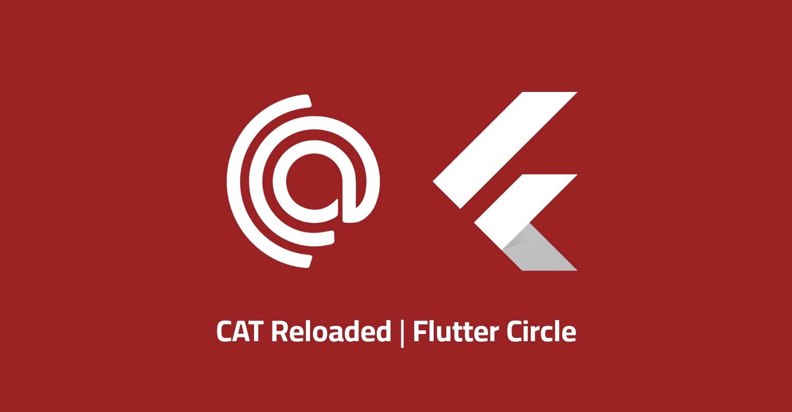

# RoadMap

# Dart

[Dart Documentation](https://dart.dev/guides)

---

# Flutter

### building UI

### dealing with user inputs

### Navigation

### Networking/api (Dealing with data from internet)

### Data storage (Local/remote)

### how to structure your application and dealing with State management

### integration with third parties plugins (Maps, Cameras, Audio, Payment….)

### Testing

### CI/CD

### how to make a package (contribution to open source)

---

## GIT

Arabic : 

- [El zero web school](https://www.youtube.com/watch?v=ACOiGZoqC8w&list=PLDoPjvoNmBAw4eOj58MZPakHjaO3frVMF)
- [Big data بالعربي](https://www.youtube.com/watch?v=Q6G-J54vgKc)

---

Levels: (Beginner - intermediate - advanced - titan)

### Beginner

- [week1](https://youtube.com/playlist?list=PL7fFnBB9LnRtZF8TIgmiL1XEY_kVq4NQO&si=N_ONYDhMnAih0QNE)
    - install dart
    - input/output values
    - comments
    - dealing with variables
        - how to make a variable
        - naming rules
        - data types
        - type conversion
    - operators
        - arithmetic
        - relational
        - bitwise
        - logical
        - assignment
        - dot
        - increment, decrement
    - String operations
    - control statements
        - if statement
        - if. Else statement
        - if. Elseif statement
        - Switch
        - while loop
        - do … while loop
        - for loop
        - for each
        - ternary operator
- [week2](https://youtube.com/playlist?list=PL7fFnBB9LnRsY1FMWaJqbcBPsrXHoC3eW&si=ciSEwn8ZRNfqXVUb)
    - Dart collections
        - list
        - set
        - map
    - Functions
    - Null safety
    - Error handling
- [week3](https://youtube.com/playlist?list=PL7fFnBB9LnRtmZUs_DPA7zkjYorvLS4l_&si=q0AJun8Q8noCFKWI)
    
    oop
    
    - what is oop?
    - Class, Constructor, object.
    - methods, attributes.
    - Encapsulation
    - Abstraction
        - abstract class
        - interface
    - Inheritance
    - poly morphism
    - mixins
    - Enum
- week4
    - OOP concepts with Omar Ahmed
    - Git & GitHub
- GitHub
- [OOP with Omar Ahmed](https://www.youtube.com/watch?v=jz8JVznL2HA&list=PLwWuxCLlF_ue7GPvoG_Ko1x43tZw5cz9v)
- week5
    - Final project
    - install Flutter

### intermediate

- [week1](https://youtube.com/playlist?list=PLKi5vUe5hkZiF0bQneuOo6OTsuV9cpyWA&si=0NWML8KpupX615Am)
- [week2](https://youtube.com/playlist?list=PLKi5vUe5hkZh6BhsGpDQBJYM_fFG9VWbL&si=epgFGP8tHTbAveKh)
- [week3](https://youtube.com/playlist?list=PLKi5vUe5hkZirFABVUTaWAyIU6mhYrNrU&si=oyhTwiMM0zW2BbgK)
- [week4](https://youtube.com/playlist?list=PLKi5vUe5hkZg-BWIUp3N0mOn_yXbUGHeh&si=fB60LVRXAkfNlZYV)
- [week5](https://youtube.com/playlist?list=PLKi5vUe5hkZhvs0bxTuMqclUPgFS7gozu&si=Oh9pexFdIAZxCPzU)
- [week6](https://youtube.com/playlist?list=PL93xoMrxRJIvPg3nW8WG0HDDgpMQtUkag&si=lld_nWv2NpjtYmDt)
- [week7](https://youtube.com/playlist?list=PL3aG1K3LWCre6DIC2amKlXjn_kd2P6zE9&si=o3bl1lsM4NI_eClD)
- [week8](https://youtube.com/playlist?list=PL93xoMrxRJIviJiC76oO5aV8bDp2s3OrA&si=1boaSVE0lA5IHy5V)
- week9

### advanced

- [week1](https://youtube.com/playlist?list=PLwJ4sQ79Ehm4TECBpsvzOWCL91Q9bj8Ce&si=U5PbLAzySvriCRRb)
- [week2](https://youtube.com/playlist?list=PL93xoMrxRJIvHhxhB21YzzeimEEzzAz6g&si=tEf3_6I8Ded6OYQg)
- [week3](https://youtube.com/playlist?list=PL93xoMrxRJIvHhxhB21YzzeimEEzzAz6g&si=BOyp5XFvbGdAnudt)
- week4
    - [SOLID Principles](https://youtube.com/playlist?list=PLwWuxCLlF_uevri_OpofVLXkRRFnZ7TSV&si=zUSrHJ2HdtTqClwD)
    - [Clean Code](https://youtube.com/playlist?list=PLwWuxCLlF_ufTMlXoJlQvImqz9wIfcWsX&si=Qt2tP0B6T-P7Ohfi)
- week5
    - [MVVM](https://youtube.com/playlist?list=PL3aG1K3LWCrfvjEBkx3ujAtg7yK0zzTiY&si=5cmqLU0QJksfEH2C)
    - [Clean architecture](https://youtube.com/playlist?list=PLwJ4sQ79Ehm69Bmed-XrRCc-_H1R3nWhd&si=uH8-X7nezokaHFJP)
- [week6](https://youtube.com/playlist?list=PL5jcF-FcaT8BJbn_DYo_5BEkPgwN80rBE&si=vLQ_adTipySXR4AE)
- [week7](https://youtube.com/playlist?list=PL41hvuiq3bcnlfsKcQ7vwf4pjModyV0F8&si=R8Ql9aB2aqrd36Dc)
- [week8](https://youtu.be/5qqi7ma8EOc?si=1sUXFc5NMDuhvGK0)
- [week9](https://youtu.be/1PZm3c-Xpoc?si=SOd8krJQu2CK87n2)

### titan

- [Data structure and algorithms](https://youtube.com/playlist?list=PLMDrOnfT8EAjT0lBMcmTiRWeaVqKXH5WC&si=Frbu1qLDx0AL4Fqi)