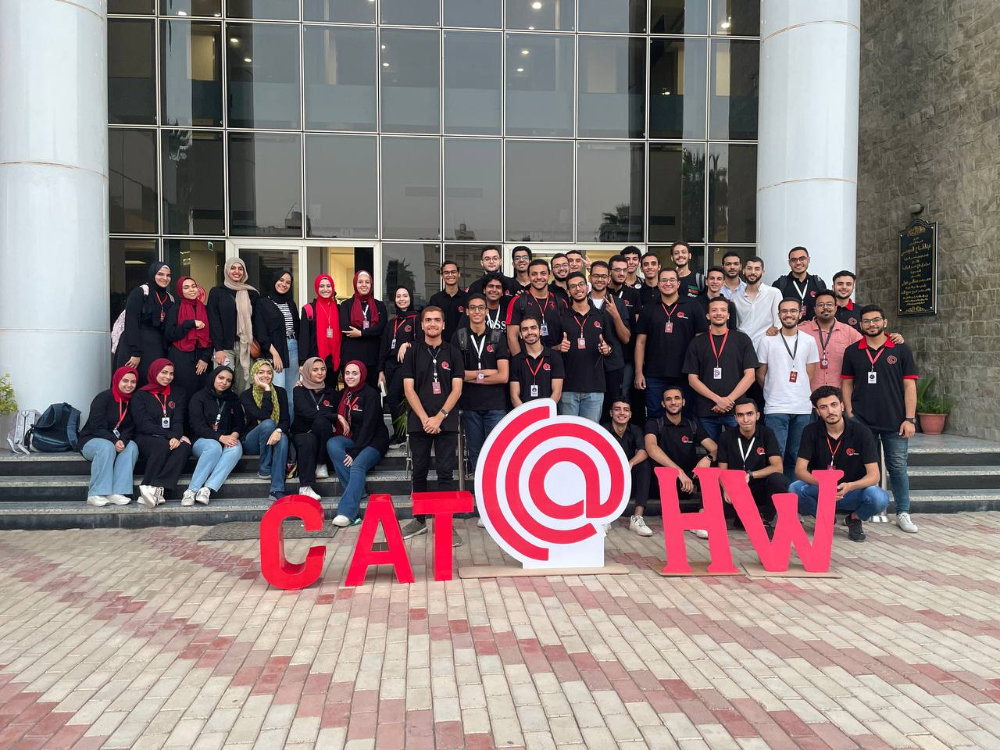

## [CAT Reloaded Roadmaps 2024](https://www.facebook.com/CATReloaded "CAT Reloaded")

---

▶ What is [CAT Reloaded](https://www.facebook.com/CATReloaded "CAT Reloaded")?

📌 [CAT Reloaded](https://www.facebook.com/CATReloaded "CAT Reloaded") Abbreviation for **C**omputer **A**ssistance **T**eam was from **1996** and reloaded again so it gained its name **CAT Reloaded** from this matter.

---

▶ What do we do in [CAT Reloaded](https://www.facebook.com/CATReloaded "CAT Reloaded")?

📌 The team is interested in forming technical circles in order to form communities that help and participate in learning modern software technology such as: **Computer Science**, **Cyber Security**, **Game Development**, **Web Development**, **Mobile Development**, **Data Science**, **Embedded Systems** and **Graphic Design**.

---

▶ How can you follow us on social media or offline?

📌 [CAT Reloaded](https://www.facebook.com/CATReloaded "CAT Reloaded") community in Mansoura, you know more about us and our activities through our social media:

💻[Website](https://catreloaded.org/ "Web site")

💻[GitHub](https://github.com/CATReloaded "Web site")

📱 [Facebook Page](https://www.facebook.com/pg/CATReloaded "Facebook Page")

📱 [Facebook Group](https://www.facebook.com/groups/catreloaded.team "Facebook Group")

📱 [X](https://x.com/CATReloaded "X")

📱 [Linkedin](https://www.linkedin.com/company/cat-reloaded/ "Linkedin")

👓[YouTube](https://www.youtube.com/user/C4TReloaded "YouTube")

---

▶ How to become a member of CAT Reloaded?

📌 Almost every year we host a recruitment [Event](https://www.facebook.com/events/1427191697864892/) called Hello, World! in Mansoura University to attract all of the interested students in Computer Science in general, categorizing them in circles meant for different fields.

