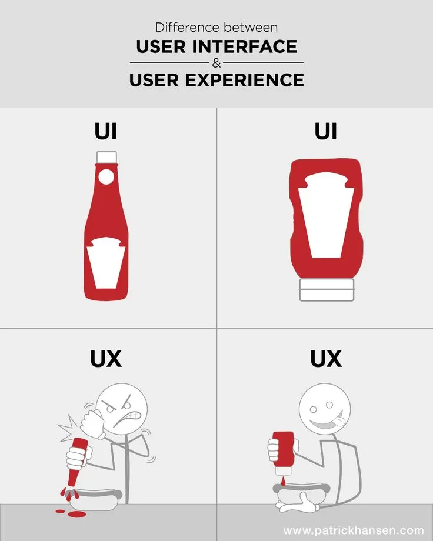
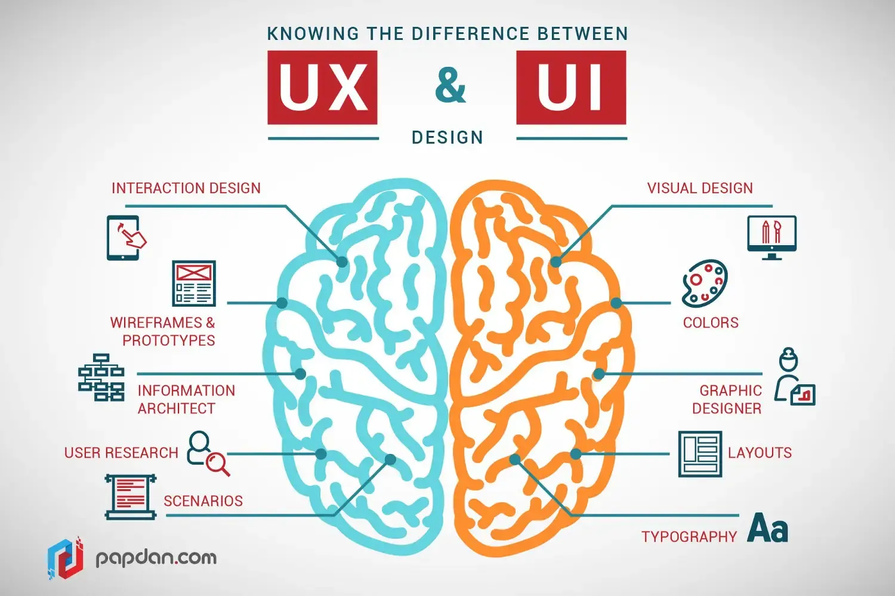

# **CAT Reloaded | UI/UX Roadmap 2025**

## **Getting Started with UI/UX Design 🚀**
This roadmap will guide you step by step. No prior knowledge? No problem! You can start from the basics. Already familiar with some concepts? Feel free to skip ahead.

First, understand the **difference between UI and UX design** to decide which suits you best—or if you want to master both!

- **User Interface (UI) Design** focuses on the **visual and interactive elements** of a product, ensuring it is aesthetically appealing, intuitive, and efficient.
- **User Experience (UX) Design** focuses on the **overall user journey**, using research and design strategies to create a seamless, user-friendly experience.

### **Resources:**
- **Videos:**
  - **Arabic:** [Watch Video](https://youtu.be/KaIzzUs2BkI)
  - **English:** [Watch Video](https://youtu.be/TgqeRTwZvIo)
- **Articles:** [Read Article](https://www.interaction-design.org/literature/article/ux-vs-ui-what-s-the-difference)

---

# **Level 1 (Beginner)**

## **Week 1: Visual Design Principles**
- **Videos:**
  - [Video 1](https://youtube.com/playlist?list=PLx03_0RRvUEE8w_ipVLwBjr9glIlU9G8M&si=-I05g3FsMuQ_dkfo)
  - [Video 2](https://youtu.be/9EPTM91TBDU?si=MOGTa_QHYdf28Gpe)
- **Articles:**
  - [Article 1](https://www.nngroup.com/articles/principles-visual-design/)
  - [Article 2](https://www.figma.com/resource-library/ui-design-principles/)
- **Task:** Summarize what you learned.

## **Week 2: Figma Interface**
- **Videos:** [Watch Video](https://youtu.be/i8mBt_883y8?si=FWyoAZICRDc2NS-i)
- **Task:** [Task Video](https://youtu.be/wD629i0yBag?si=C4Jal0iwYzOAFo60)

## **Week 3: Basics of UI Design (Colors & Typography)**
- **Videos:**
  - **Colors:** [Video 1](https://youtu.be/1SfKlnZxdNw?si=HyMqytYhkboVa7Dr), [Video 2](https://youtu.be/0xl67wDdOvg?si=uLERZ79Q7Qa4RgQC)
  - **Typography:** [Video 1](https://youtu.be/IgcyqReaUb8?si=jgTfAkCORUDKpORd), [Video 2](https://youtu.be/3JJDVIBdUwo?si=hR84Dksvnb3F-Wxi)
- **Articles:**
  - **Colors:** [Read Article](https://uxcel.com/blog/beginners-guide-to-color-theory)
  - **Typography:** [Read Article](https://careerfoundry.com/en/blog/ui-design/typography-ui-design/)
- **Task:** [Watch Task Video](https://youtu.be/8RSXFMEt17M?si=YY-O8OgnlotNr2Wj)

## **Week 4: Basics of UI Design (Spacing & Layout)**
- **Videos:**
  - **Spacing:** [Watch Video](https://youtu.be/kr7ExgMWmAY?si=IeR4D0wE3WU5fJFx)
  - **Layout:** [Video 1](https://youtu.be/gJ5SHjWMTyE?si=j-tci4eecv5TWO_f), [Video 2](https://youtu.be/nHRcr2NivzU?si=hY4TBsrDXKNX11RZ), [Video 3](https://youtu.be/rxOvJsjuGIA?si=3lGy79eCUosJDRoo)
  - **Grid:** [Watch Video](https://youtu.be/dBE0zuTn29k?si=X3KhcwGErRXx1yY_)
- **Articles:** [Read Article](https://medium.com/@uiuxzee/ultimate-spacing-guide-for-ui-designers-342f4c61bd70)
- **Task:** [Travel-Mobile-App](https://dribbble.com/shots/25469543-Travel-Mobile-App)

## **Week 5: Basics of UX Design**
- **What is UX Design?** [Watch Video](https://youtu.be/3zICP8XADfs)
- **Videos:** [UX Foundations](https://www.youtube.com/playlist?list=PLTZYG7bZ1u6oHnGp4Ib3n0y-CmFQdTW6r)
- **Courses with Certificate:**
  - [Edraak (Free)](https://www.edraak.org/en/programs/specialization/uiux-v1/)
  - [Udacity](https://www.udacity.com/course/ux-designer-nanodegree--nd578)

## **Week 6: Time for the First Project!**
- **Task:** Create an app idea with at least 10 screens applying all learned concepts.

---

# **Level 2 (Intermediate)**

## **Week 1: Auto Layout**
- **Videos:**
  - [UI Video 1](https://youtu.be/VJD1SvXEXE4?si=0QpUFY2kFTmr-FY3)
  - [UI Video 2](https://youtu.be/-6Cd0r3taRo?si=KX-N4hXtvLhl7oam)
  - [UI Video 3](https://youtu.be/EEfqMYcCexo?si=NsuxbA1I_N2msFva)
  - [UI Video 4](https://youtu.be/0_NRDUjnoPA?si=zgMczetdNm1WXOg1)
  - [UX Playlist](https://youtube.com/playlist?list=PLtS8Ubq2bIlUWixdH_1Q2yzZh8QJSBVmT&si=1Pqj8AOZBm2DueLr)
- **Articles:** [Read Article](https://www.figma.com/blog/behind-the-feature-the-making-of-the-new-auto-layout/)
- **Task:**
  - **UI:** Apply Auto Layout to [Login Screens](https://dribbble.com/shots/17948091-Log-In-Screens-for-Online-Learning-Mobile-App)
  - **UX:** Summarize key points from the UX playlist.

## **Week 2: Component & Variant**
- **Videos:**
  - [UI Video 1](https://youtu.be/j55a1IFda3A?si=oilExCVAxuz2WOJE)
  - [UI Video 2](https://youtu.be/eMgnfFHYTV8?si=oTwCh-7ypEbP3f9r)
  - [UI Video 3](https://youtu.be/otkYZD3VJ4E?si=ye98cEaUh_6ZmHNM)
  - [UI Video 4](https://youtu.be/0_NRDUjnoPA?si=9_htToAEriHZOsBK)
  - [UX Playlist](https://youtube.com/playlist?list=PLtS8Ubq2bIlUWixdH_1Q2yzZh8QJSBVmT&si=1Pqj8AOZBm2DueLr)
- **Articles:** [Read Article](https://www.linkedin.com/pulse/understanding-components-uxui-design-sof%C3%ADa-garc%C3%ADa-mx3if/)
- **Task:**
  - **UI:** Create components for Navbar, Button, Footer, Label, and Card.
  - **UX:** Summarize key points from the UX playlist.

## **Week 3: Styles**
- **Videos:**
  - [UI Video](https://youtu.be/78Yiblp1Ib4?si=VmivQnkV1KiVVv9o)
  - [UX Playlist](https://youtube.com/playlist?list=PLtS8Ubq2bIlUWixdH_1Q2yzZh8QJSBVmT&si=1Pqj8AOZBm2DueLr)
- **Articles:** [Read Article](https://help.figma.com/hc/en-us/articles/360039238753-Styles-in-Figma)
- **Task:**
  - **UI:** Create Main - Secondary - Basic Colors  then, Add color, typography as styles **(with it's different shades then add them into figma)**
  - **UX:** Summarize what you learned from UX Playlist as points.

## **Week 4: Prototyping and Scrolling**
- **Videos:**
  - [UI Prototype Video](https://youtu.be/SeJ2WS0RzJg?si=rIVOOgbPtgn0YQ2s)
  - [UI Scroll Video 1](https://youtu.be/ZVoZp9eNVdI?si=v-mUQ6uGz28st-3w)
  - [UI Scroll Video 2](https://youtu.be/EobSNkzdN7A?si=SjotGQeqUOM_D__C)
  - [UX Playlist](https://youtube.com/playlist?list=PLtS8Ubq2bIlUWixdH_1Q2yzZh8QJSBVmT&si=1Pqj8AOZBm2DueLr)
- **Articles:** [Read Article](https://help.figma.com/hc/en-us/articles/360040314193-Guide-to-prototyping-in-Figma)
- **Task:**
  - **UI:** [Travel-Mobile-App](https://dribbble.com/shots/23936170-Travel-Mobile-App) (apply horizontal and vertical scrolling on these screens).
  - **UX:** Summarize key points from the UX playlist.

## **Week 5: Design System**
### Part (1) : Text Fields & Buttons
- **Videos:**
  - [UI Video 1](https://youtu.be/_SK2L3Nns_s?si=AgocOEOKHprZ9Zay)
  - [UI Video 2](https://youtu.be/4STqQw-gMtE?si=ioLNrxkHrOIuOflL)
  - [UI Video 3](https://youtu.be/gvDOui1V5l4?si=K_CtpLm1PuL2eQ92)
  - [UX Playlist](https://youtube.com/playlist?list=PLtS8Ubq2bIlUWixdH_1Q2yzZh8QJSBVmT&si=1Pqj8AOZBm2DueLr)
- **Articles:** [Read Article](https://www.figma.com/blog/design-systems-101-what-is-a-design-system/)
- **Task:**
  - **UI:** Make all possible variations for Text Fields and Buttons.
  - **UX:** Summarize key points from the UX playlist.

## **Week 6: Design System**
### Part (2) : Dropdowns & Checkbox & Radio Buttons
- **Videos:**
  - [UI Video 1](https://youtu.be/MXnzu6RtHJU?si=fTg0zqgjHsFYv-u_)
  - [UI Video 2](https://youtu.be/vfCAFDtENVE?si=kuE7HXh_42VtZGkd)
  - [UI Video 3](https://youtu.be/qu53GgSgOak?si=ZTLhTsLiyJbgoMGR)
  - [UX Playlist](https://youtube.com/playlist?list=PLtS8Ubq2bIlUWixdH_1Q2yzZh8QJSBVmT&si=1Pqj8AOZBm2DueLr)
- **Articles:** [Read Article](https://www.figma.com/blog/design-systems-101-what-is-a-design-system/)
- **Task:**
  - **UI:** Make all possible variations for Dropdowns, Checkbox, and Radio buttons.
  - **UX:** Summarize key points from the UX playlist.

## **Week 7: Grid for Web**
- **Videos:**
  - [UI Video 1](https://youtu.be/xUfiMPTz2mI?si=RJ_tH7Af0u_zPhpS)
  - [UI Video 2](https://youtu.be/Puqqgs_uLi4?si=4kFuNbD6lY1k3YkE)
  - [UX Playlist](https://youtube.com/playlist?list=PLtS8Ubq2bIlUWixdH_1Q2yzZh8QJSBVmT&si=1Pqj8AOZBm2DueLr)
- **Articles:** [Read Article](https://www.uxdesigninstitute.com/blog/how-to-use-grids-in-web-design/)
- **Task:**
  - **UI:** [Task Video](https://youtu.be/6-pzw7HXimg?si=aejMdJfK20x9IXZp).
  - **UX:** Summarize key points from the UX playlist.

## **Week 8: Responsive Design**
- **Videos:**
  - [UI Video 1](https://youtu.be/g1LDcbIcqgQ?si=0DhrWSwCV1SlCh1_)
  - [UI Video 2](https://youtu.be/gwiX0oASlEw?si=GmYAD0CcL_r2ApbN)
  - [UX Playlist](https://youtube.com/playlist?list=PLtS8Ubq2bIlUWixdH_1Q2yzZh8QJSBVmT&si=1Pqj8AOZBm2DueLr)
- **Articles:** [Read Article](https://www.figma.com/resource-library/responsive-website-design/)
- **Task:**
  - **UI:** Make the previous task responsive.
  - **UX:** Summarize key points from the UX playlist.

## **Week 9: Dashboard**
- **Videos:**
  - [UX Playlist](https://youtube.com/playlist?list=PLtS8Ubq2bIlUWixdH_1Q2yzZh8QJSBVmT&si=1Pqj8AOZBm2DueLr)
- **Articles:** [Read Article](https://www.figma.com/resource-library/responsive-website-design/)
- **Task:**
  - **UI:** [Task Link](https://youtu.be/XgDD6Xxw-H8?si=A0Q6q0P-5cxFYeRA).
  - **UX:** Summarize key points from the UX playlist.

## **Week 10: Variables**
- **Videos:**
  - [UI Video 1](https://youtu.be/MDS1F_S8iJ8?si=yYr32Wqynq8AveSl)
  - [UI Video 2](https://youtu.be/a6w1_ZaVhVo?si=GsQ1JodKsy9FQsal)
  - [UX Playlist](https://youtube.com/playlist?list=PLtS8Ubq2bIlUWixdH_1Q2yzZh8QJSBVmT&si=1Pqj8AOZBm2DueLr)
- **Articles:** [Read Article](https://help.figma.com/hc/en-us/articles/15339657135383-Guide-to-variables-in-Figma)
- **Task:**
  - **UI:** [Task Link](https://www.pinterest.com/pin/1011410028812407078/) (Apply it with variables and everything you learned).
  - **UX:** Summarize key points from the UX playlist.

## **Week 11: Time for the Second Project!**
- **Task:**

    Create an app idea with at least 16 screens, applying everything you've learned so far:

    ✅ Use Auto Layout for flexible and responsive designs.

    ✅ Utilize Components to maintain consistency.

    ✅ Implement the Grid System for structured layouts.

    ✅ Build a Design System to streamline your project.

    This is your chance to showcase your skills and bring your creativity to life! 🚀

---

For the full roadmap, ensure you continue following each week's structured learning! 🚀

