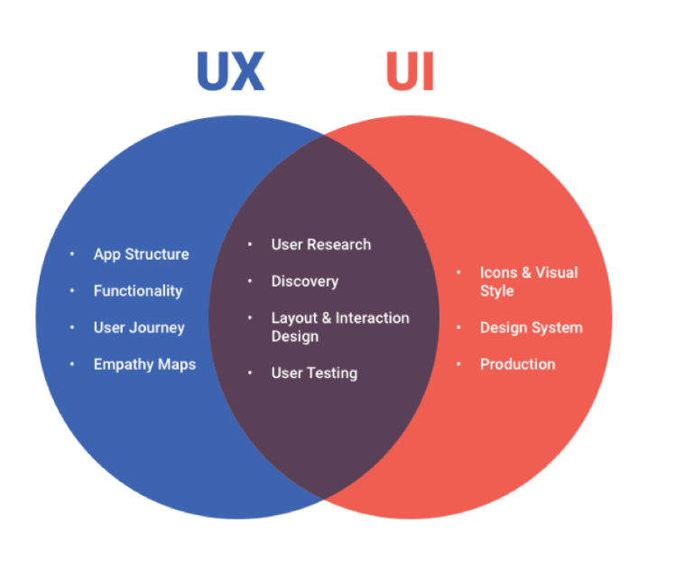

# UI UX Roadmap 2023

*This roadmap assumes that you do not have any knowledge of design. If you are familiar with some things here, feel free to skip them. If not, you can continue reading.*

*Note : You have to know first the difference between UI / UX to determine if the field is suitable for you and which one you prefer more ( UI or UX )*

# **Difference between UI / UX :**

### **Videos :**

- English: [YouTube Video](https://youtu.be/TgqeRTwZvIo)
- Arabic : [YouTube video](https://youtu.be/KaIzzUs2BkI)

### Courses :

- [Edraak course](https://programs.edraak.org/learn/specialization/uiux-v1)

### Article :

- [The Simple Difference Between UX, UI and Graphic Design](https://interworks.com/blog/smacadamia/2020/01/20/the-simple-difference-between-ux-ui-graphic-design/#:~:text=Unlike%20UX%20or%20UI%20design%2C%20however%2C%20graphic%20design,all%20are%20helpful%20for%20communicating%20with%20your%20audience.)

# **Focus on one design tool :**

- [Which tool is better for you ?](https://youtu.be/phK8XwtSph0)

### 1- Figma :

- Arabic tutorial :
    - [Ehab Fayez](https://www.youtube.com/watch?v=7K7pEPFepWA&list=PLjzhiGLyugKynpBi7v2AWMCJgTrRI6Ne-)
- English tutorial :
    - [Figma](https://youtube.com/playlist?list=PLXDU_eVOJTx6zk5MDarIs0asNoZqlRG23)
    - [Figma tips](https://www.youtube.com/watch?v=CGWbit0BDQM&list=PLXDU_eVOJTx53btRMBES-ASBBm03-bUCJ)

# Knowledge without action is USELESS

- [Some collected designs](https://www.checklist.design/)

**1-  Figma**

- [Food App in Figma](https://youtu.be/1h73MOcH3xA)
- [Cab Booking App](https://youtu.be/UyDV7F34QJE)
 

# **Design Theory :**

NOTE : Here, you’re trying to understand the theory that goes behind colour, the terminologies in typography, and training your brain in understanding shapes and forms. **Design theory is the asking and answering of the question “Why am I designing it this way?”**

- [What is Design Theory ?](https://blog.shillingtoneducation.com/design-theory/)

NOTE : Going from bad design to perfect one needs just to add principles while you are designing !

- **UI principles :**
    - [The Gestalt Principles](https://youtu.be/FryaH599ec0)
    - [Graphic Design Workshop](https://www.youtube.com/playlist?list=PLH3tw9J9QyRoA9EfB7YPncAfg4kn5bW44)
    - [The 4 Golden Rules of UI Design](https://xd.adobe.com/ideas/process/ui-design/4-golden-rules-ui-design/)
    - • [10 Fundamental UI Design Principles You Need to Know](https://dribbble.com/resources/ui-design-principles)
    
- **Colors :**
    - [Color](https://youtu.be/_2LLXnUdUIc) ********
    - [60-30-10 Color Rule](https://youtu.be/UWwNIMHFdW4)
    - [What Do Colors Mean and How Do They Affect Consumers](https://youtu.be/x0smq5ljlf4)
    - [Color pallet](https://colorhunt.co/)
    
- **Typography :**
    - [Typographic Scales in Web Design & UI Design](https://youtu.be/ot-5dQG2v5M)
    - [How to choose fonts for your projects and what size to use](https://youtu.be/vnDh1KRN2GM)
    - [Typographic Scales vs. Typographic Systems](https://youtu.be/Ie0Adpe-0eM)
    - [10 Principles for Typography in UI Design](https://uxdesign.cc/10-principles-for-typography-usage-in-ui-design-a8f038f43ffd)

- **Contrast :**
    - [User Interface (UI) Design Principles](https://youtu.be/FmSjtWTIx1o)
    - [Color Contrast, Bad contrast, Good Contrast in UI/UX | Design Fundamental.](https://youtu.be/SVIPGIx-mlU)

- **Hierarchy :**
    - [11 Visual Hierarchy Design Principles](https://youtu.be/ZXItTIjC0Wk)

- **Repetition :**
    - ‘[Repetition’ Design principle](https://youtu.be/u55BW6WBqVU)

- **Alignment :**
    - [How to Use Alignment in UI Design](https://youtu.be/WaCzXkGYI4w)

- **proximity:**
    - [Proximity’ Design principle](https://youtu.be/xUdqSiI_G8Y)

- **Layout  & Composition :**
    - [Layout & Composition](https://youtu.be/a5KYlHNKQB8)
    - [How to Use White Space in UI Design (UI Principles Series)](https://www.youtube.com/watch?v=8gu4lFtVcyY)
    - [Grid Systems in Web & UI Design](https://youtu.be/n_V_aLqYPI0)
    - [Importance of Auto Layout in Responsive Design](https://blog.perfist.com/importance-of-auto-layout-in-responsive-design/)
    
      ****
    
- **Balance :**
    - [Balance](https://youtu.be/S3Jne3xrMsM)
    - [Principles of Design: Balance](https://youtu.be/97PcgsE1gXc)

# Resources to help you design

- **Icons**
    - [IconFinder](https://www.iconfinder.com/)
    - [Icons from Google](https://fonts.google.com/icons?selected=Material+Icons)
    - [Icons8](https://icons8.com/)
    - [Free icons](https://freeicons.io/)

- **Illustration**
    - Storyset
    - [UnDraw](https://undraw.co/)
    - [Illustration](https://illustation.io/)

- **High quality pictures**
    - [Freepic](https://www.freepik.com/)
    - [Unsplash](https://unsplash.com/explore)
    - [Pixels](https://www.pexels.com/)
    
    or 
    
    - [Remove background from pictures](https://www.remove.bg/)
    
- **Fonts**
    - [Google Fonts](https://fonts.google.com/)
    - [Arabic Fonts](https://arbfonts.com/)
    
- **Grid**
    - [8-Point Grid](https://spec.fm/specifics/8-pt-grid?fbclid=IwAR1g_goEhw0SNhix91zj1yLNeAvmW8Qg5Ab4ia-OiXSgvSuqgMhPlbbI9m8)
    - [GRID systems for beginners](https://youtu.be/pxN8w-ywSuc)

- **Design Systems ( Help you to know how to use the principles you learned )**
    
    Note :[Design Systems and Their Benefits](https://youtu.be/3TpiNrZlzt4)
    
    - [Material Design of Google](https://m2.material.io/design)
    - [Material Design of IOS](https://m2.material.io/develop/ios)
    - [Human interface guidelines for iOS and Apple platforms](https://developer.apple.com/design/human-interface-guidelines/guidelines/overview/)
    - [Material design For Android](https://m3.material.io/)
    - [Tailwind ui documentation](https://www.youtube.com/redirect?event=video_description&redir_token=QUFFLUhqbWNKN1lQa3FBZ1k4YjNHYVVKRW1TbHpieFVRZ3xBQ3Jtc0trRERIUUJIMzFnbXNxeGUzNTJOcHhUOXU1X1c0VEZHTHcwMUlCV1VpMlVOcDhzblhTQWQ1MlpYM0VHT0Y4LThEeW1ndjhXUmF3NkpjYk80alZMcklmRmo2WnJpbkVFQjlXZ1o5YTh3aGJjUjBoejBEYw&q=https%3A%2F%2Ftailwindcss.com%2Fdocs%2F&v=Rl88hHD-BHs) ( UI roles for web designing )
    - [MATERIAL DESIGN](https://m2.material.io/)
    - [A / B testing for websites](https://goodui.org/)
    - Extra :
        - [Difference between design systems , Pattern Libraries & Style Guides](https://youtu.be/HNkNXBZ4weM)

# **UI Tasks -**

 ****“We all know that practice makes us perfect . Without practicing and self determination our goals can’t be achieved”**

## **From Tutorials**

- **Figma**
    - [Task 1](https://youtu.be/DoA_D6tmo6o)
    - [Task 2](https://youtu.be/6aE9ItSIh2c)
    - [Task 3](https://youtu.be/48YwaTiYau0)
    
- **Adobe XD**
    - [Task 1](https://youtu.be/Ey0cGB2ixOQ)
    - [Task 2](https://youtu.be/AYMJTfmXAnc)
    - [Task 3](https://youtu.be/PVcUFCT0J0Q)

### **Copying from others**

- [Task 1](https://dribbble.com/shots/18277526-Banking-App)
- [Task 2](https://dribbble.com/shots/19083280-Camera-Shop-App)
- [Task 3](https://dribbble.com/shots/17785662-Website-Design-landing-page)
- [Task 4](https://dribbble.com/shots/9324251-Task-Management-Application-Design)

### **Generating from scratch by yourself**

- [Fake clients website](https://fakeclients.com/)

# Getting deeper in UX

- **Importance of UX & it`s effect**
    - [Importance in general](https://youtu.be/9ZlVOV0v36Q)
    - [How a Good UX can Impact your Business](https://youtu.be/mrFSKsnYVDY)
    - [Translating UX to Business Value](https://youtu.be/2pou-FnTaFM)
- **Courses to start in UX**
    - [Udacity Grant](https://egfwd.com/specializtion/ux-design/)
    - [Product design course - Udacity](https://www.udacity.com/course/product-design--ud509)
    - [Human-Computer Interaction - udacity](https://www.udacity.com/course/human-computer-interaction--ud400)
    - [Course 2 from Edraak](https://programs.edraak.org/learn/course/ux-v1)
    - [7 UX Google courses](https://www.coursera.org/professional-certificates/google-ux-design)

- **UX principles :**
    - [Guide to UX research](http://guidetouxr.com/?ref=designresourc.es)

- ***Some of the UX Methodologies are :***
    - [User Interviews](https://youtu.be/KZ6jj_EZUgM)
    - [Surveys](https://youtu.be/exyHMFVrZCg)
    - [Focused Group Discussions](https://youtu.be/3w32jIsRlsw)
    - [Usability Testing](https://youtu.be/JSVK4HjOTX4)
    - [Personas](https://youtu.be/_Z_6cls0Or8)
    - [Customer Journey Maps](https://youtu.be/3iwL2OEeWiw)
    - [Information Architecture](https://youtu.be/ylvITZEAHX0)
    - [Card Sorting](https://youtu.be/f7JwluKWwIc)
    
    And many more…
    

- **Articles :**
    - [Laws of UX](https://lawsofux.com/)
    - [UX design principles for a great user experience](https://www.justinmind.com/ux-design/principles)
    - [7 fundamental UX design principles](https://www.uxdesigninstitute.com/blog/ux-design-principles/)
    - [5 Principles of Visual Design in UX](https://www.nngroup.com/articles/principles-visual-design/)

- ****Digital Psychology****
    
     *Note : To understand how humans act online, why human act in specific ways, and how you can use that to your advantage when designing your product. . Think of this topic as something that you need a certain amount for this period, but you can learn more about it overtime after that.*
    
    - [What is digital psychology ?](https://www.waldenu.edu/online-masters-programs/ms-in-psychology/resource/what-is-digital-psychology#:~:text=Digital%20psychology%20is%20an%20arena,motivation%2C%20learning%2C%20and%20others.)
    - [Behavioral economics](https://youtu.be/xEOHahiuTko)
    - [Human behavior](https://youtu.be/5X4mjWHV6yw) ( Behavior-Centered Design)

# Useful links for UI / UX

- **Articles :**
    - [Ux design articles and books](https://www.interaction-design.org/literature)
    - [NNG](https://www.nngroup.com/)
    - [Interaction design foundation articles and books](https://www.interaction-design.org/literature?ep=arabian-uix)

- **Books :**
    - Books to start
        - [Don`t make me think](https://drive.google.com/file/d/1RaG_nXltHorPWoxbxfrT7iSs531ZtaCf/view?usp=sharing)
        - [The design of everyday things](https://drive.google.com/file/d/1Kwagkwwp5MuwN5h-mtHXmDoWwlxabuvz/view?usp=share_link)
    - Other books
        - [Ux Research books](https://drive.google.com/drive/folders/1a6RyzMkQFw-k4mxtP67M6AdK9bKqMPdo?usp=share_link)
        - [UX Information Architecture](https://drive.google.com/drive/folders/1FHbvgYnDK05tqf8fcS1e5xs7nvCsJJAE?usp=share_link)
        - [UX for Web](https://drive.google.com/drive/folders/1YverFBIWAiky57vnL6jYijcRjDsn0UWJ?usp=share_link)
        - [UX for mobile](https://drive.google.com/drive/folders/1DBI6xAEB12gyJPocipzgikOywrQGrmfe?usp=share_link)
        - [UX collaboration](https://drive.google.com/drive/folders/1SpClDutdfWDvFO6haWqqp6ixuo_gehOx?usp=share_link)
        - [Usability](https://drive.google.com/drive/folders/17tQX2w3ppG0hUJMBGi4nYG8dFTjodxWw?usp=share_link)
        - [UI](https://drive.google.com/drive/folders/1lrdnikuVcNLnJ668jcYZQXIgj1yf1wYT?usp=share_link)
        - [Interaction design books](https://drive.google.com/drive/folders/1kwjtgaKTXUryEQwLDWLRpN5HA1OwyKyY?usp=share_link)
        - [Design Basics](https://drive.google.com/drive/folders/1aA4Y5dgMmq79XiVrNxl3_QuVS_74lzUA?usp=share_link)
        
- **visual feed:**
    - [Behance](https://www.behance.net/)
    - [Dribble](https://dribbble.com/)
    - [Mobbin](https://mobbin.com/browse/ios/apps)
    - [Pinterest](https://www.pinterest.com/)
    - [Awwwards](https://www.awwwards.com/)

- **YouTube channels**
    - [Mizko](https://www.youtube.com/channel/UCZJkZy008cQjqkJeKpJu8tA)
    - [DesignCourse](https://www.youtube.com/user/DesignCourse)
    - [Flux](https://www.youtube.com/c/FluxWithRanSegall)
    - [Howard Pinsky](https://www.youtube.com/IceflowStudios)
    - [Ahmed Sekmani](https://www.youtube.com/c/AhmadMSekmani)
    

***Remember , there is no a roadmap will give you all the aspects of the field , You need to search deeper by yourself .***

**CAT Reloaded** 

Aya Sherif.
